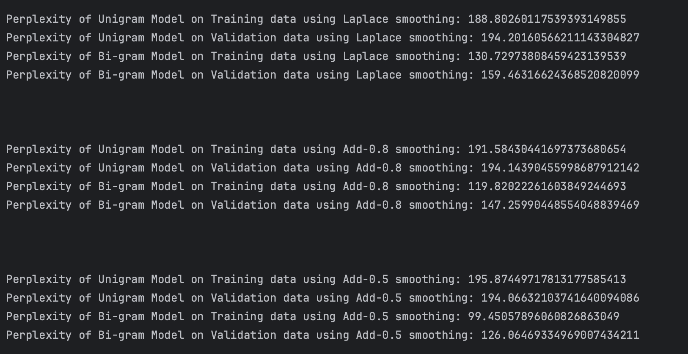

# N-Gram Language Model

This project implements an N-gram-based language model using unigram and bigram probabilities. The project reads a corpus of text, preprocesses the data by adding sentence boundary tokens (`</start>`, `</end>`), and builds both unsmoothed and smoothed N-gram models. It also computes perplexity for both training and validation datasets to evaluate the model's performance.

The project is built using *PyCharm Community IDE*, and it should be run locally. The repository contains the following files:
- `main1.py` - Implements an unsmoothed N-gram model.
- `main2.py` - Implements a smoothed N-gram model with Laplace (Add-1) and Add-K smoothing.
- `main3.py` - Computes the perplexity of the models on training and validation datasets.
- `train.txt` - Contains the training corpus.
- `val.txt` - Contains the validation corpus.

## Project Setup

### Prerequisites

- *Python 3.x* installed on your local machine.
- *PyCharm Community IDE* (or any other IDE).
- Ensure that `train.txt` and `val.txt` files are in the project directory.

### Download the repository

1. **Clone the repository**:
   Clone the repository to your local machine using the following command:
   ```bash
   git clone https://github.com/KrishnaRohithVemulapalli/Assignment1NLP.git


### Run the scripts:

Open the project in PyCharm or any other IDE.
Run any of the scripts (main1.py, main2.py, or main3.py) directly from the IDE or using the terminal. 

## Files Overview
### 1. main1.py - Unsmooth N-Gram Model
This script reads the training corpus (train.txt), adds boundary tokens ( </ start>, </ end> ), and counts unigrams and bigrams. It computes the unsmoothed probabilities of unigrams and bigrams and exports the results to a text file (ngram_probabilities.txt). The probabilities are sorted in descending order.

#### Key Functions:

read_corpus(file_path): Reads and preprocesses the text corpus.

count_ngrams(corpus): Counts unigrams and bigrams.

compute_unigram_probs(): Computes unsmoothed unigram probabilities.

compute_bigram_probs(): Computes unsmoothed bigram probabilities.

export_results(): Exports the probabilities to a text file.

### 2. main2.py - Smoothed N-Gram Model (Laplace and Add-K Smoothing)
This script builds a smoothed N-gram model by replacing infrequent words with <UNK> and applying Laplace (Add-1) or Add-K smoothing. It counts unigrams and bigrams and computes probabilities, accounting for unseen bigrams. The results are saved to a text file (ngram_probabilities_Laplace_smoothing.txt or ngram_probabilities_add_k_smoothing.txt).

#### Key Functions:

replace_with_unknown(): Replaces words below a threshold with < UNK>.

compute_unigram_probs(): Computes smoothed unigram probabilities.

compute_bigram_probs(): Computes smoothed bigram probabilities, handling unseen bigrams.

export_results(): Exports the smoothed probabilities to a text file.

### 3. main3.py - Perplexity and Model Evaluation
This script calculates the perplexity of both the training and validation datasets for the smoothed N-gram model. Perplexity is a measure of how well the model predicts the next word, with lower values indicating better performance.

#### Key Functions:

replace_with_unk(): Replaces words in the validation corpus with <UNK> if they are not in the training corpus.

compute_perplexity(): Calculates the perplexity for both unigram and bigram models.
The script prints perplexity results for the training and validation datasets after running the model.

### Example Output
When running main3.py, the model will compute and print the perplexity for both unigram and bigram models with different smoothing techniques. Here’s an example output:




### Dataset
The dataset used in this project consists of tokenized reviews of Chicago hotels. There are two files provided:

train.txt: The training dataset.

val.txt: The validation dataset.

Both files are already tokenized, and the tokens are separated by spaces.

### Evaluation
Perplexity: The perplexity metric is used to evaluate the performance of the language models. The model's perplexity is calculated based on the validation dataset, with lower perplexity values indicating better performance.

Smoothing: The project explores different smoothing techniques such as Laplace (Add-1) and Add-K smoothing, which help handle unseen words or bigrams in the validation dataset.

Unknown Words: Words not present in the training dataset are replaced by <UNK> to handle unseen words during model evaluation.

### Conclusion
This project demonstrates the implementation of unsmoothed and smoothed N-gram language models using Python. It includes the computation of unigram and bigram probabilities and evaluates the model using perplexity on both training and validation datasets. Feel free to experiment with different smoothing techniques and thresholds to observe their impact on model performance.
